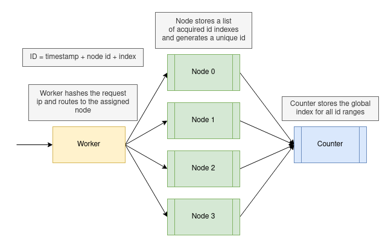

# Snowflake 

A semi-sequential unique ID generation service using Cloudflare Workers and Durable Objects.

- IDs are sortable by time created 
- IDs created by a single node are always increasing
- Unique ID index prevents duplicates for IDs created on the same node at the same millisecond



1. Requests are routed to a specific node based on ip address
2. Nodes request id ranges from the global Counter object to use during ID generation
3. Nodes generate unique ids using their local time, node id, and available id ranges

`1671312351570-7-205`
```json
{
  "id":"16713123515707205",
  "node":7,
  "index":205,
  "ts":1671312351570
}
```

## TODO
- [ ] create space efficient binary id format with fixed size